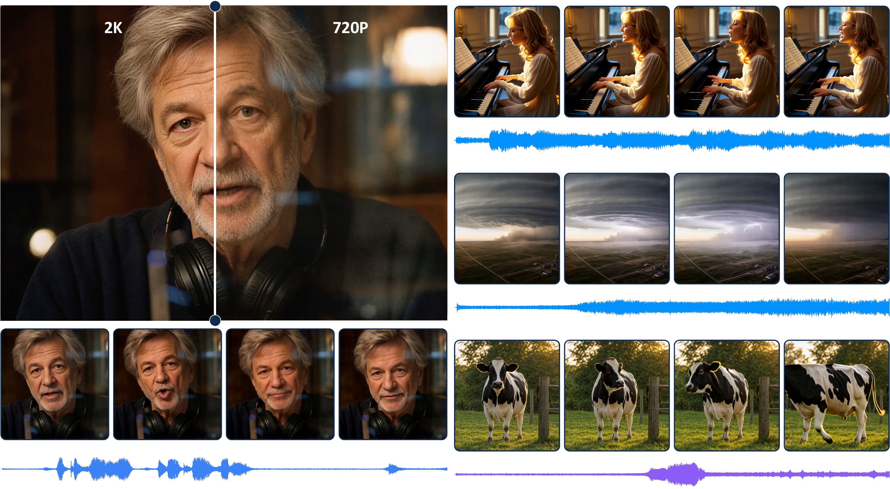

<div align="center">
  

  <h1>DreamX-Creator 1.0: Democratizing Native Audio-Video Generation at 2K Resolution</h1>

  DreamX Team

</div>

<div align="center">

[](https://arxiv.org/abs/2608.31106)
[](https://huggingface.co/GD-ML/DreamX-Creator)
[](https://modelscope.cn/models/GD-ML/DreamX-Creator)
[](LICENSE)

</div>

-----

**DreamX-Creator 1.0** is a research framework for **native joint audio-video generation**. Given a first frame and a text prompt, its implemented base generator jointly models modality-specialized video and audio streams, using **Gated Cross-Modal Attention** and **Progressive Joint Training** to enable bidirectional audio-video interaction.

The broader system combines **Audio-Video Reinforcement Learning** with **Modality-Aware Multimodal Feedback** to improve visual and audio quality, semantic consistency, and fine-grained audio-video synchronization. **Autoregressive 1-Step 2K Refinement** then upgrades the generated video to high-quality 2K output while preserving content, motion, and audio-aligned timing.

## :clapper: Demo

<div align="center">
  <video src="https://github.com/user-attachments/assets/e49fc64d-5b31-4c16-be1d-737dc3aef04b" controls></video>
</div>

## :fire: News

- **Sep 3, 2026:** Open-sourced the model weights and released the inference code for the 7B joint audio-video generator and the Autoregressive 1-Step 2K Refiner.
- **Sep 1, 2026:** Initialized the DreamX-Creator project repository with its overview and release roadmap.

## :calendar: Plan

- :heavy_check_mark: Initialize the DreamX-Creator project repository.
- :heavy_check_mark: Release the DreamX-Creator 1.0 technical report.
- :heavy_check_mark: Release validated model weights, inference code, and configurations.
- [ ] Release distilled, faster models with fewer sampling steps for reduced latency.

## :open_file_folder: Repository Structure

- [`audio_video_generation/`](./audio_video_generation/) — 7B native joint audio-video generator (single GPU). See its [README](./audio_video_generation/README.md) for usage, input overrides, and memory options.
- [`video_refiner/`](./video_refiner/) — Autoregressive 1-step 2K refiner (SR-DiT 5B). See its [README](./video_refiner/README.md) for usage and the full list of inference knobs.
- [`checkpoints/`](./checkpoints/) — All model weights (not in the git repo). See its [README](./checkpoints/README.md) for the expected layout and download instructions.

## :package: Model Weights

Model weights are distributed on [HuggingFace](https://huggingface.co/GD-ML/DreamX-Creator)
and [ModelScope](https://modelscope.cn/models/GD-ML/DreamX-Creator) and should
be placed under `checkpoints/` (details in [`checkpoints/README.md`](./checkpoints/README.md)):

```
checkpoints/
├── creator/                     # DreamX-Creator 1.0 joint generator (7B, LoRA merged)
│   ├── video_model/             # video DiT shards + config
│   ├── audio_model/             # audio DiT + config
│   └── cross_attn_weights.safetensors  # gated A2V/V2A cross-modal attention
├── audio_vae/                   # CreatorDACVAE audio VAE
├── refiner/                     # 2K refiner
│   ├── sr_dit_5b.pt             # SR-DiT 5B refiner
│   ├── latent_upsampler_flash.pt       # FlashLatentUpsampler (default)
│   ├── latent_upsampler_2d_causal.pt   # causal 2D latent upsampler (optional)
│   └── lightvae_nu_scheme3.pt          # distilled fast decoder (optional, off by default)
└── wan2.2_ti2v_5b/              # shared Wan2.2-TI2V-5B dependencies
    ├── Wan2.2_VAE.pth           # video VAE
    ├── models_t5_umt5-xxl-enc-bf16.pth  # UMT5-xxl text encoder
    └── google/umt5-xxl/         # tokenizer
```

The `wan2.2_ti2v_5b/` directory can also be downloaded directly from
[Wan-AI/Wan2.2-TI2V-5B](https://huggingface.co/Wan-AI/Wan2.2-TI2V-5B); only the
three entries above are needed.

## :rocket: Quickstart

Each subdirectory is self-contained with its own `requirements.txt` and README.

**1. Joint audio-video generation** (first frame + prompt to synchronized
video with audio):

```bash
cd audio_video_generation
pip install -r requirements.txt
./inference.sh                        # runs the default Verse-Bench case (case1)
```

See [audio_video_generation/README.md](./audio_video_generation/README.md) for
input overrides, CPU-offload options, output details, and multi-GPU
sequence-parallel inference.

**2. 2K refinement** (super-resolve a generated or external video, audio
unchanged):

```bash
cd ../video_refiner
pip install -r requirements.txt
INPUT=/path/to/video.mp4 bash run_inference.sh
```

See [video_refiner/README.md](./video_refiner/README.md) for the full list of
knobs (KV cache, window attention, speed/quality trade-offs).

## :books: Citation

If you find DreamX-Creator useful in your research, please consider citing our technical report:

```bibtex
@misc{zhu2026dreamxcreatordemocratizingnativeaudiovideo,
  title={DreamX-Creator: Democratizing Native Audio-Video Generation at 2K Resolution},
  author={Jiashu Zhu and Yanhao Zheng and Ruitian Tian and Rujing Dang and Shen Zhang and Bingze Song and Jiachen Lei and Ruimin Lin and Jiahong Wu and Xiangxiang Chu},
  year={2026},
  eprint={2608.31106},
  archivePrefix={arXiv},
  primaryClass={cs.CV},
  url={https://arxiv.org/abs/2608.31106},
}
```

## :scroll: License

This project is licensed under the Apache License 2.0. See [LICENSE](LICENSE) for details.

## :sparkles: Acknowledgement

We would like to thank the [Wan Team](https://github.com/Wan-Video/Wan2.2), the [OpenMOSS Team](https://github.com/OpenMOSS/MOVA), and the [VideoX-Fun Team](https://github.com/aigc-apps/VideoX-Fun) for their outstanding open-source work on Wan, MOVA, and VideoX-Fun, respectively.
